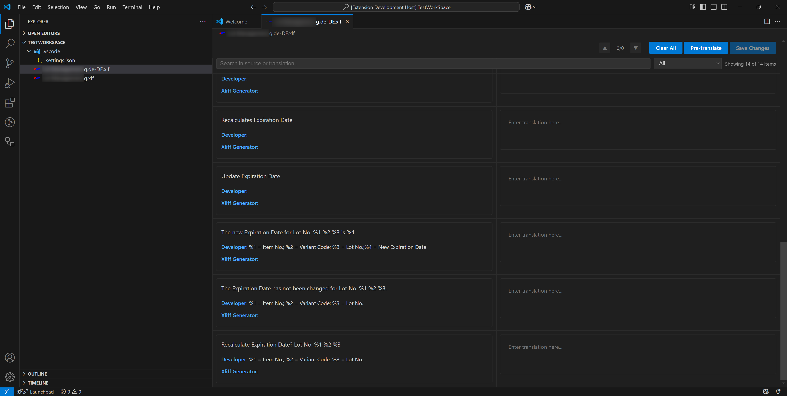
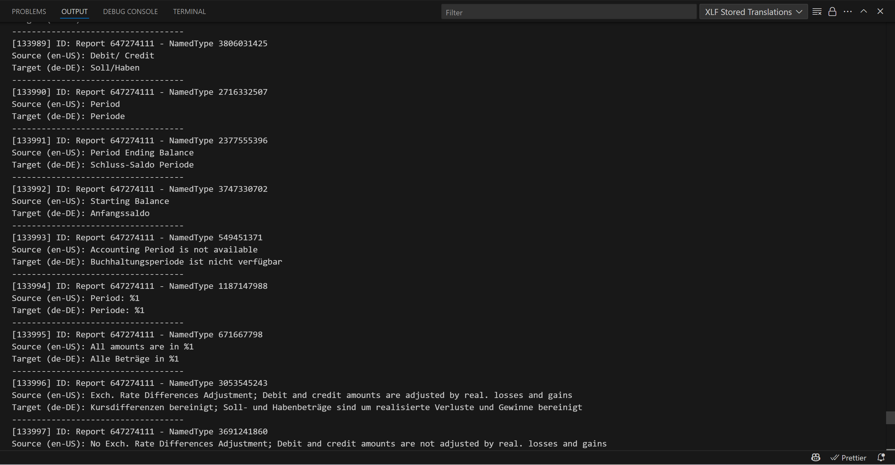
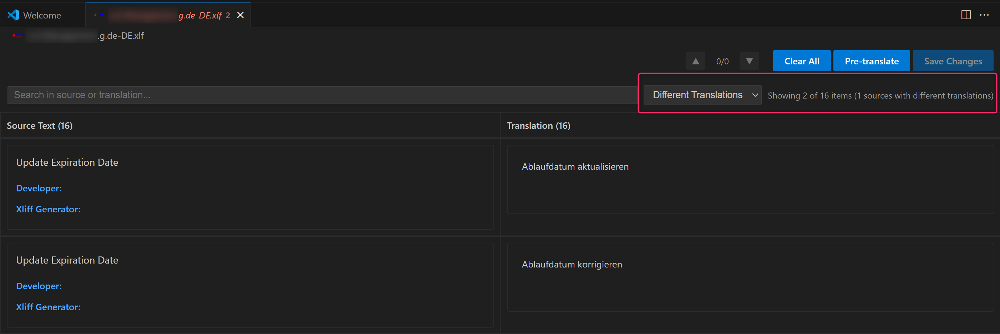

# XLF Editor

**XLF Editor** is a powerful Visual Studio Code extension for editing, translating, and managing XLF translation files, especially for Business Central projects. It provides a modern, user-friendly interface for translators and developers, with productivity features like pre-translation, duplicate detection, and reference management.

---

## Features

- **Custom Editor for XLF Files:**  
  Open `.xlf` files in a dedicated, interactive editor with side-by-side source and translation columns.
- **Pre-Translation:**  
  Automatically fill in translations using stored references or similar strings.
- **Duplicate Detection:**  
  Instantly find and highlight source texts with different translations.
- **Reference Management:**  
  Import, clear, and view stored translations for reuse across projects.
- **Batch Operations:**  
  Clear all translations or pre-translate entire files with a single click.
- **Advanced Filtering & Search:**  
  Filter by untranslated, translated, or duplicate entries and search within source or translation texts.
- **VS Code Integration:**  
  Leverages the [Custom Editor API](https://code.visualstudio.com/api/extension-guides/custom-editors) for a seamless experience.

---

## Screenshots

### Main Editor View

### Show Translation Storage

### Pre-Translation in Action

### Duplicate Detection

---

## Getting Started

1. **Install the Extension:**  
   Search for `XLF Editor` in the VS Code Marketplace or install from [here](https://marketplace.visualstudio.com/).

2. **Open an XLF File:**  
   Right-click any `.xlf` file and select **Open With > XLF Translator**.

3. **Use the Command Palette:**  
   - `XLF Editor: Open XLF File`
   - `XLF Editor: Import XLF File`
   - `XLF Editor: Clear imported XLF File`
   - `XLF Editor: Show Stored Translations`
   - `XLF Editor: Pre-translate XLF File`

   > See [extension.ts](xlf-editor/src/extension.ts) for command implementations.

---

## Extension Settings

This extension contributes the following settings:

- `xlfEditor.pretranslateMinPercent`  
  *Type:* `number` (default: `100`)  
  Minimum percent match for pre-translation to apply.

- `xlfEditor.preferredTranslationSource`  
  *Type:* `string` (default: `ask`)  
  Preferred source for translations when multiple matches are found.  
  Options: `storage`, `file`, `ask`

See [`package.json`](xlf-editor/package.json) for the full configuration schema.

---

## Requirements

- Visual Studio Code `^1.97.0`
- Node.js `>=18.18.0` (for development/build)
- No additional dependencies required for end users.

---

## Known Issues

- Only XLIFF 1.2 files are supported.
- Large files may take longer to process during pre-translation.
- See [issues](https://github.com/DaJan404/xlfeditor/issues) for the latest updates.

---

## Release Notes

See [`CHANGELOG.md`](xlf-editor/CHANGELOG.md) for detailed release history.

---

## Contributing

Contributions are welcome! Please see the [VS Code Extension Guidelines](https://code.visualstudio.com/api/references/extension-guidelines) and open issues or pull requests on [GitHub](https://github.com/DaJan404/xlfeditor).

---

## Resources

- [VS Code Custom Editors](https://code.visualstudio.com/api/extension-guides/custom-editors)
- [VS Code Extension API](https://code.visualstudio.com/api)
- [XLIFF 1.2 Specification](https://docs.oasis-open.org/xliff/v1.2/os/xliff-core.html)

---

**Enjoy translating with XLF Editor!**
